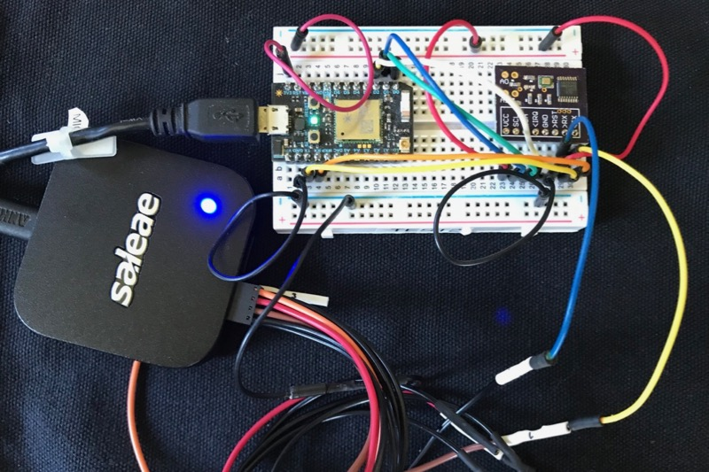
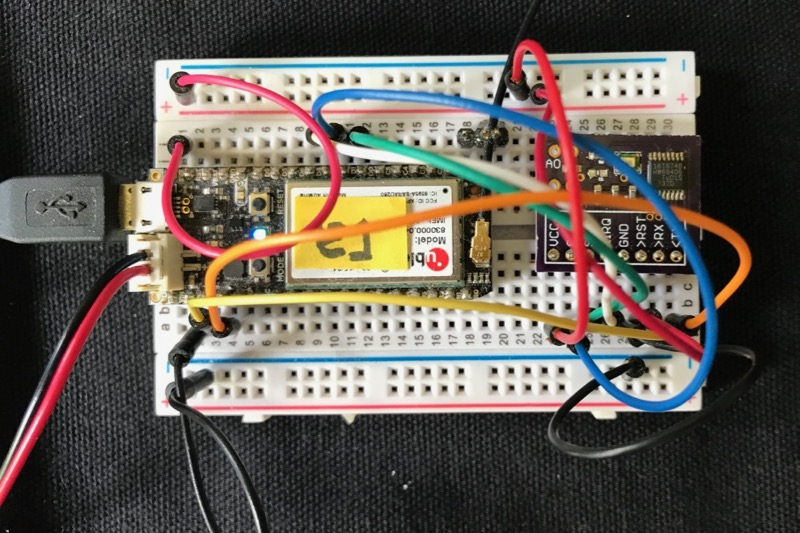

# SC16IS740RK

*Interface to SC16IS740 UART for Particle devices*

It is recommended that you use 
[https://github.com/rickkas7/SC16IS7xxRK](https://github.com/rickkas7/SC16IS7xxRK)
which is an updated version of this library, instead. The new SC16IS7xxRK library supports 
dual-port chips, hardware flow control, and other options.
 

- Project Location: https://github.com/rickkas7/SC16IS740RK
- License: MIT. You can use this library without fee in open and closed-source projects. 

Sometimes you need more serial ports (UARTs) than are provided on the Particle Photon and Electron. One handy technique is to use an external I2C/SPI UART, such as the NXP SC16IS740.

This version supports I2C and SPI, but does not support hardware or software flow control or interrupts. Other features will be added later.

This library is also compatible with the mesh devices: Argon, Boron, and Xenon.

One difficulty is that the chip is only available in surface mount packages such as the TSSOP16. You'll need to use a [TSSOP-16 breakout board](https://www.adafruit.com/product/1207), make your own board (as described below) or put it directly on your own circuit board. As the pins are very small you may find it difficult to hand solder; it really should be mounted using a reflow oven.

You can connect up to 4 separate SC16IS740 chips to the single I2C interface on D0 and D1 by I2C.

The number of separate chips for SPI is limited to the number of available GPIO pins, as each one must have a unique CS pin, but they can share a single SPI bus.

When using a 1.8432 MHz oscillator it supports baud rate from 50 to 115200.

Note that the default I2C speed is 100 KHz, so it will be impossible to read or write continuously at 115200, but bursts that fit within the size of the FIFO (64 bytes) are fine.

Also, you can increase the speed of the I2C bus if all of the I2C devices support high speed mode by adding:

```
Wire.setSpeed(CLOCK_SPEED_400KHZ);
```

## Using the library

Include the SC16IS740RK library in your project and use it as follows:

```
#include "SC16IS740RK.h"

// Pick a debug level from one of these two:
SerialLogHandler logHandler;
// SerialLogHandler logHandler(LOG_LEVEL_TRACE);

SC16IS740 extSerial(Wire, 0);

char out = ' ';

void setup() {
	Serial.begin(9600);

	delay(5000);

	extSerial.begin(9600);
}

void loop() {
	while(extSerial.available()) {
		int c = extSerial.read();
		Log.info("received %d", c);
	}

	extSerial.print(out);
	if (++out >= 127) {
		out = ' ';
	}
	delay(100);
}
```

```
SC16IS740 extSerial(Wire, 0);
```

This initializes an SC16IS740 object as a global variable. The second parameter is the address set on the A0 and A1 pins. 

```
	extSerial.begin(9600);
```

Call begin() in setup() to set the baud rate. You can also set the number of data bits, parity, and stop bits.

The SC16IS740 library derives from Stream so the standard Arduino features like print, println, readUntil, etc. all work with this library.

## API

#### `public  `[`SC16IS740`](#class_s_c16_i_s740_1a48a15f05e738b52cca9549046b6360c5)`(TwoWire & wire,int addr,int intPin)` 

Construct the UART object. Typically done as a global variable.

#### Parameters
* `wire` The I2C port to use, typically Wire.

* `addr` The address you've set using the A0 and A1 pins, 0-3. This will be converted to the appropriate I2C address. Or you can directly specify the actual I2C address 0-127.

* `intPin` The interrupt pin (-1 = not used). Note: interrupts are not currently supported.


#### `public inline `[`SC16IS740`](#class_s_c16_i_s740)` & `[`withOscillatorHz`](#class_s_c16_i_s740_1a2bade8e74f73cd4175b295d7f6e620ce)`(int value)` 

Set the oscillator frequency in Hz (default: 1843200)

You must call this before begin.

#### `public void `[`begin`](#class_s_c16_i_s740_1a2914d7b2eb94a0d9413c295611814cd2)`(int baudRate,uint8_t options)` 

Set up the chip. You must do this before reading or writing.

#### Parameters
* `baudRate` the baud rate (see below)

* `options` The number of data bits, parity, and stop bits

You can call begin more than once if you want to change the baud rate. The FIFOs are cleared when you call begin.

Available baud rates depend on your oscillator, but with a 1.8432 MHz oscillator, the following are supported: 50, 75, 110, 134.5, 150, 300, 600, 1200, 1800, 2000, 2400, 3600, 4800, 7200, 9600, 19200, 38400, 57600, 115200

The valid options in standard number of bits; none=N, even=E, odd=O; number of stop bits format: OPTIONS\_8N1, OPTIONS\_8E1, OPTIONS\_8O1 OPTIONS\_8N2, OPTIONS\_8E2, OPTIONS\_8O2 OPTIONS\_7N1, OPTIONS\_7E1, OPTIONS\_7O1 OPTIONS\_7N2, OPTIONS\_7E2, OPTIONS\_7O2

#### `public inline void `[`blockOnOverrun`](#class_s_c16_i_s740_1a146f0afeb2d5efe71d2c44285a8260dd)`(bool value)` 

Defines what should happen when calls to [write()](#class_s_c16_i_s740_1ae95bfe10661800710fb0c3ed399dd6da)/print()/println()/printlnf() that would overrun the buffer.

blockOnOverrun(true) - this is the default setting. When there is no room in the buffer for the data to be written, the program waits/blocks until there is room. This avoids buffer overrun, where data that has not yet been sent over serial is overwritten by new data. Use this option for increased data integrity at the cost of slowing down realtime code execution when lots of serial data is sent at once.

blockOnOverrun(false) - when there is no room in the buffer for data to be written, the data is written anyway, causing the new data to replace the old data. This option is provided when performance is more important than data integrity.


## Test Circuit

In this circuit, I made the following connections:

- 1 VCC to 3V3 (red)
- 2 SCL to D1 (blue)
- 3 SDA to D0 (green)
- 4 <IRQ Can leave unconnected (not currently used) (white)
- 5 GND to GND (black)
- 6 >RST Can leave unconnected (red)
- 7 >RX to TX (yellow)
- 8 <TX to RX (orange)

Remember in serial you typically connect TX to RX and vice-versa. 

Also note that the serial is 3.3V logic level. You'll need a driver to connect it to a real RS232C device using +/- 12V signals!

The SC16IS740 is 5V tolerant on RX, however only when powered! If you can run into a case where the SC16IS740 is not powered, you can only supply 3.8V to RX. 






## Custom breakout board

I've included the Eagle CAD files for the breakout board I used above. 

- 1x 0.1 uF capacitor 0603
- 6x 10K ohm resistor 0603
- 1x [1.8432 MHz oscillator](https://www.digikey.com/product-detail/en/avx-corp-kyocera-corp/KC3225K1.84320C1GE00/1253-1488-1-ND/5322590) $1.36
- 1x [SC16IS740 UART](https://www.digikey.com/product-detail/en/nxp-usa-inc/SC16IS740IPW,112/568-3648-5-ND/1154236) $2.80


The holes marked A0 and A1 are designed for standard breakaway 0.1" header pins. The addresses have pull-downs on them so the default is 0, but if you install the header pins and a jumper, they'll be pulled high so you can set address 0 - 3.

## SPI Mode

In most cases, you'll save GPIO pins by using I2C. However, if you need the fastest speed possible, such as if you want multiple 115200 data streams, or if you want to do 230400 baud, you'll want to use SPI.

For the primary SPI (SPI):

| Name | Flash Alt Name | Particle Pin | Example Color |
| ---- | -------------- | ------------ | ------------- |
| SS   | CS             | A2           | White         |
| SCK  | CLK            | A3           | Orange        |
| MISO | DO             | A4           | Blue          |
| MOSI | DI             | A5           | Green         |

Instead of instantiating a SC16IS740 object, use the SC16IS740SPI object:

```
SC16IS740SPI extSerial(SPI, A2);
```

For the secondary SPI (SPI1):

| Name | Flash Alt Name | Particle Pin | Example Color |
| ---- | -------------- | ------------ | ------------- |
| SS   | CS             | D5           | White         |
| SCK  | CLK            | D4           | Orange        |
| MISO | DO             | D3           | Blue          |
| MOSI | DI             | D2           | Green         |

Instead of instantiating a SC16IS740 object, use the SC16IS740SPI object:

```
SC16IS740SPI extSerial(SPI1, D5);
```

## Version History

### 0.0.8 (2023-08-20)

- Recommendation to use SC16IS7xxRK instead.

### 0.0.7 (2020-05-04)

- Fix compiler error for undefined conversion to SpiClass with 1.5.1-rc.1.

### 0.0.6

- Fix compiler error for ambiguous requestFrom with 1.5.0-rc.2.

### 0.0.3

On mesh devices, temporarily disable SPI DMA as this causes a SOS fault on multi-byte read or write operations when using SPI. 

